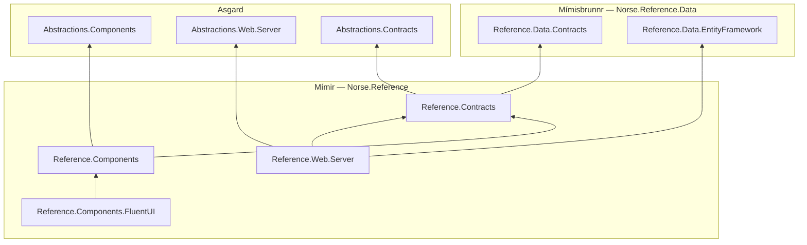

# Mímir

> Mímir — beheaded in the Æsir-Vanir war, yet still carried and consulted by Odin for counsel.

*Image credit: [@norsemythologyclips](https://www.instagram.com/norsemythologyclips/) — go follow them.*

The serving layer for the Norse Architecture's reference data — **`Norse.Reference.Components`**, **`.Components.FluentUI`**, **`.Web.Server`**, and **`.Worker`**: headless Blazor machinery, the FluentUI rendering of it, the gRPC service plus its REST facade, and the background worker that keeps ISO/IANA data current. Nobody needs the well itself to get an answer — they need Mímir's head, wherever it's carried, which is exactly what this realm does against [Mímisbrunnr](https://github.com/NorseArchitecture/Mimisbrunnr)'s data. In the dependency chain it rides on Mímisbrunnr's published surfaces and Asgard's law; Yggdrasil's hosts ride on *it* in turn.

## The dependency graph

Arrows point at the thing depended on. The two wells render as separate subgraphs but share one namespace root (`Norse.Reference`) deliberately — one bounded context, two repositories, split for release cadence alone. Non-Norse packages (FluentUI) are off the chart by convention.

Dependencies are transitive-first by house law — the browser-safe baked surface (`Reference.Data.Contracts`) reaches the component pair through `Reference.Contracts`, so no direct edge exists; `Reference.Web.Server` is the one project touching the entity side (`Reference.Data.EntityFramework`), and NORSE073 guarantees the components never can. The component pair follows [Heimdall](https://github.com/NorseArchitecture/Heimdall)'s vendor split: `Reference.Components` is the headless shared home (validators, vendor-neutral machinery), and a host opts into a rendering by picking its vendor — `Reference.Components.FluentUI` is currently the only one, and a different design system lands as a sibling, not an edit.

## Status

Mímir is the serving layer, end to end. **`Reference.Contracts`** carries the wire records: `CountryRequest` (the wire-stamped request — the serialized member is the `Result<IsoCountryCode>` verdict, minted by the `CodeInput` buffer's setter on every assignment) and the full-document `CountryResponse` — identity, codes, name, the UN `Classification` flags, and the `RegionResponse → SubregionResponse → IntermediateRegionResponse` ancestry chain, the entire `CountryOrAreaView` document rather than a scalar skim. **`Reference.Web.Server`** resolves it by any of the four accepted input forms — alpha-2, alpha-3, M49 numeric (padded or unpadded), or the baked deterministic v5 identifier, so a foreign key read straight off a persisted row hydrates the full ISO canon with no join — over two doors: the gRPC `ReferenceService` and the realm-resident REST facade (`CountriesController`, `GET api/reference/countries/{code}`), both running the same mediator pipeline in-process. **`Reference.Components`** is the headless home (`CountryRequestValidator`, rules registered on the stamp), and **`Reference.Components.FluentUI`** renders `CountryLookup` on Asgard's `OutcomeFormComponentBase` form machinery — unparseable input never buys a round trip, server failures render through the form's own validation display, and a successful lookup proves the wire's identifier against the client's compile-baked `Iso3166.Ids` copy of the same canon. The generated reference surface — the `IsoCountryCode` enum with its quad-form parser, the `Iso3166` dataset, and `ReferenceNamespaces` — generates in [Mímisbrunnr](https://github.com/NorseArchitecture/Mimisbrunnr) (`Reference.Data.Contracts`/`.Namespaces`) and arrives here by reference.

## Why two repos

Mímisbrunnr and Mímir are one bounded context split across two repositories for a specific, verified reason: reference-data content (IANA reissuing time zone data, ISO adding or redenominating currencies) changes far more often than the service and component code that serves it, and the platform's release tooling only supports repo-scoped tags — packing and publishing happen for an entire repo at once, not per project. Splitting the repository is what lets `Data` cut a release without dragging `Components`/`Web.Server`/`Worker` along, and vice versa. This pair is a template for anyone whose own reference data has the same shape — not a pattern the platform applies by default.

## The cosmos

Mímir is one realm of the [Norse Architecture](https://github.com/NorseArchitecture). The whole platform composes at [Bifröst](https://github.com/NorseArchitecture/Bifrost) — clone once, cross the bridge, and every session starts there so decisions get brainstormed across the entire landscape, not in isolation. Every design is tried in [Glitnir](https://github.com/NorseArchitecture/Glitnir), the design court, before code is forged here; this realm's specs and plans will live in the court's [docs/Mímir/](https://github.com/NorseArchitecture/Glitnir/tree/master/docs/Mimir) once they converge.

## Soundtrack: War of the Gods

